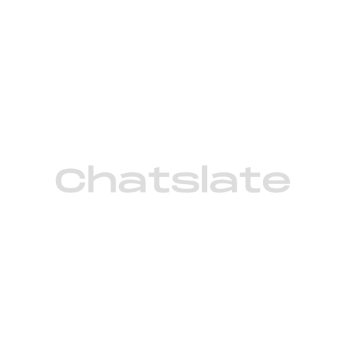
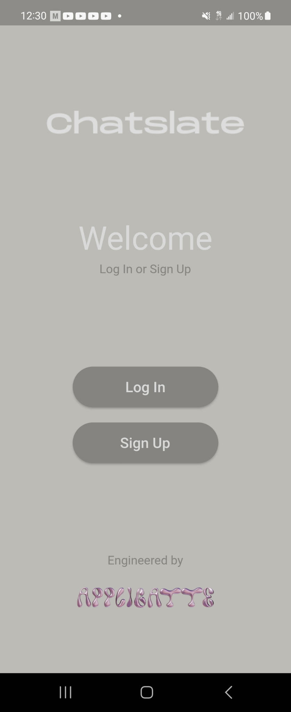
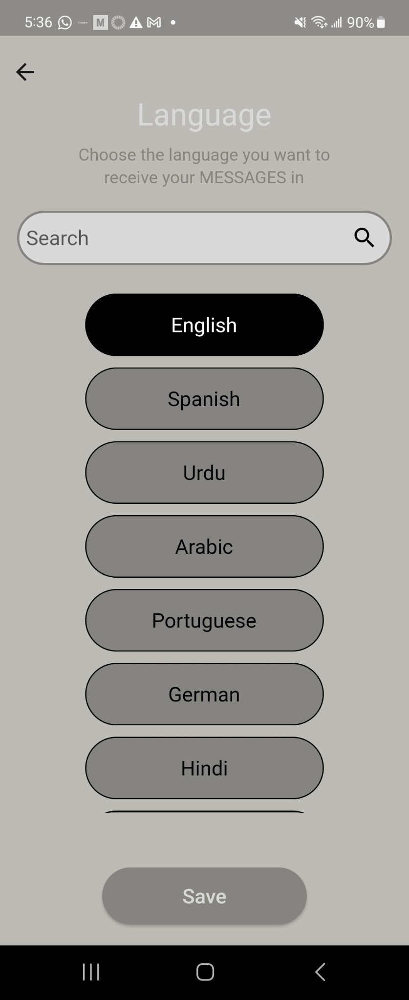
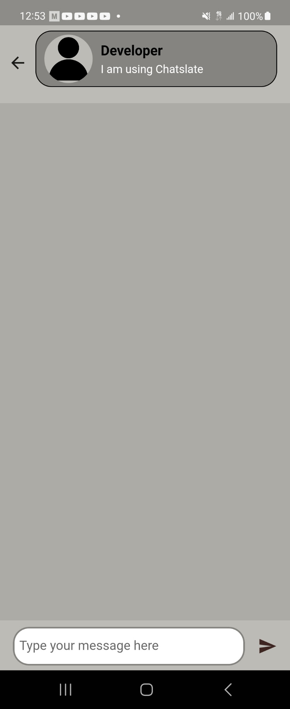

<p align="center">
  
</p>

# Chatslate

**Chatslate** is a real-time multilingual messaging app built with **Flutter** & **Firebase**.  
It integrates the **Google Translate API** to automatically detect and translate messages into the user’s preferred language, enabling barrier-free communication across cultures.  

## 🎥 Demos

<p align="center">
  <a href="https://youtube.com/shorts/8wjD3ZvYFgw">
    
  </a>
</p>

<p align="center">
  <a href="https://youtube.com/shorts/-sPHL7VneR0">
    
  </a>
</p>


## Screenshots
<p align="center"></p>
<p align="center"></p>
<p align="center"></p>
<p align="center"></p>
<p align="center"></p>
<p align="center"></p>
<p align="center"></p>

## Features
- **Real-time multilingual chat** with automatic language detection & translation.  
- **Google Translate API** integration for seamless cross-language conversations.  
- **Profile customization**: set profile pictures (visible to others), captions/status, and preferred language.  
- **Contacts**: create and save contacts for easier communication.  
- **Persistent conversations**: all chats sync with your account when you log back in.  
- **Firebase Authentication** for secure login.  
- **Cloud Firestore** for real-time chat data management.  
- **UI/UX** fully designed in Figma; logo crafted in Canva.  
- **Planned expansion**: Voice translation for hands-free messaging and accessibility; per-conversation language customization (set one language for one contact, another for a different contact, or keep original), and an in-chat toggle to reveal the original message alongside translations.

## Tech Stack
- **App:** Flutter (Dart)  
- **Backend:** Firebase Authentication · Cloud Firestore  
- **Translation:** Google Translate API  
- **Design:** Figma (UI/UX), Canva (branding)  
- **Platform:** Android (cross-platform ready)  

## Requirements
- Flutter SDK (latest stable)  
- Dart SDK (bundled with Flutter)  
- Firebase project (Authentication + Firestore enabled)  
- Google Cloud project with **Google Translate API** enabled  

## Installation
Clone the repo and install dependencies:

```bash
# Clone
git clone https://github.com/liscontoli/Chatslate.git
cd Chatslate

# Install dependencies
flutter pub get
